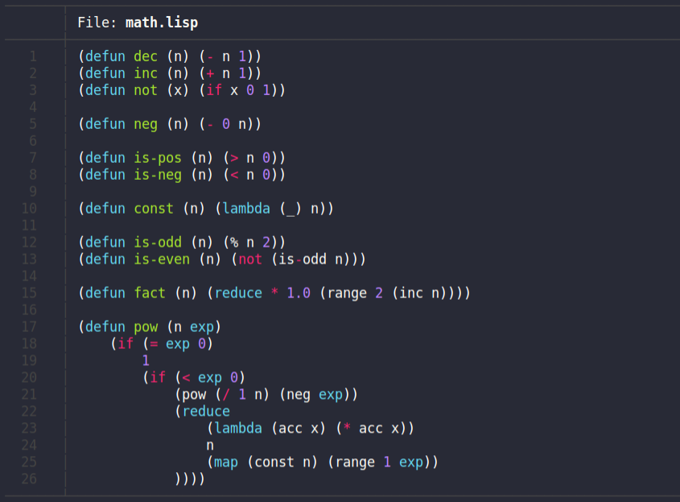

<div align="center">
  <h1>👻<b>wisp</b>✨</h1>
  <p>
    <strong>A lisp👽 written in C++</strong>
  </p>
  <p float="left">
    
    
  </p>
</div>

## Why write a lisp?

Lisp is one of those niche, beautiful languages that people only use for two specific purposes:

1. Write a lisp interpreter
2. To illustrate that code is data!!

_So why add to the list of infinite lisp interpreters?_

The answer is simple: _**I'm bored out of my mind in quarantine.**_ If you were looking to find out why _this particular_ lisp is special, you're fresh out of luck. 

But isn't the fact that it's a lisp _*enough*_?


yes.

## Syntax and Special Forms

Like every other lisp, this language uses s-expressions for code syntax and data syntax. So, for example, the s-expression `(print 5)` is both a valid code snippet, and a valid list containing the items `print` and `5`.

When the data `(print 5)` is evaluated by the interpreter, it evaluates `print` and `5`, and then applies `print` to `5`. 

Here's the result.

```lisp
>>> (print 5)
5
 => 5
```

That's super cool! But what if we want to define our own functions? _We can use the builtin function `defun`!_

```lisp
; define a function `fact` that takes an argument `n`
(defun fact (n)
  (if (<= n 1)
     1
     (* n (fact (- n 1)))
   ))
```

Thats awesome! But did you notice anything different about the `defun` function? _It doesn't evaluate its arguments._ If the atom `fact` were evaluated, it would throw an error like so:

```lisp
>>> fact
error: the expression `fact` failed in scope { } with message "atom not defined"
```

This is known as a special form, where certain functions "quote" their arguments. We can quote things ourselves too, but the language _automatically_ quotes arguments to special forms itself.

If you want to "quote" a value yourself, you can do it like this.

```lisp
; quote the s-expression (1 2 3) so it's not evaluated
>>> (print '(1 2 3))
(1 2 3)
 => (1 2 3)
```

As you can see, quote negates an evaluation. For example, whenever the expression `''a` is evaluated, it becomes `'a`. This can be useful for when you want to write long lists of data or variable names without wanting to evaluate them as code.

|Special Form|Argument Evaluations|Purpose|
|:-|-|-|
|`(if cond a b)`|`if` only evaluates its `cond` argument. If `cond` is truthy (non-zero), then `a` is evaluated. Otherwise, `b` is evaluated.|This special form is the main method of control flow.|
|`(do a b c ...)`|`do` takes a list of s-expressions and evaluates them in the order they were given (in the current scope), and then returns the result of the last s-expression.|This special form allows lambda functions to have multi-step bodies.|
|`(scope a b c ...)`|`scope` takes a list of s-expressions and evaluates them in the order they were given _in a new scope_, and then returns the result of the last s-expression.|This special form allows the user to evaluate blocks of code in new scopes.|
|`(defun name params body)`|`defun` evaluates none of its arguments.|This special form allows the user to conveniently define functions.|
|`(define name value)`|`define` evaluates the `value` argument, which is then assigned to `name` in the current scope.|This special form allows the user to bind atoms to values in a scope.|
|`(lambda params body)`|`lambda` evaluates none of its arguments.|This special form allows the user to define anonymous functions.|
|`(quote x)`|`quote` evaluates none of its arguments.|This is equivalent to the `'expr` syntactic sugar.|
|`(for x list ...)`|`for` evaluates only its list argument.|`for` iterates through the list storing each element in `x`, and then evaluating all of the rest of the values in the `for` body. It then returns the last value evaluated.|
|`(while cond ...)`|`while` evaluates only its cond argument.|`while` evaluates its condition expression every iteration before running. If it is true, it continues to evaluate every expression in the `while` body. It then returns the last value evaluated.|


## Examples

Here are some example math-y functions to wrap your head around.

```lisp
; quicksort
(defun qs (l)
    (if (<= (len l) 1)
        l
        (do
            (define pivot (first l))
            (+
                (qs (filter (lambda (n) (> pivot n)) l))
                (list pivot)
                (qs (tail (filter (lambda (n) (<= pivot n)) l)))
            ))
    ))

; decrement a number
(defun dec (n) (- n 1))
; increment a number
(defun inc (n) (+ n 1))
; not a bool
(defun not (x) (if x 0 1))

; negate a number
(defun neg (n) (- 0 n))

; is a number positive?
(defun is-pos? (n) (> n 0))
; is a number negative?
(defun is-neg? (n) (< n 0))
```

## Usage

Using and compiling wisp

#### Dependencies

Compile with your C++ compiler of choice. This is compatible with all standard versions of C++ since ANSI C++.

```bash
$ git clone https://github.com/adam-mcdaniel/wisp
$ cd wisp
$ g++ wisp.cpp -o wisp
```

#### Using the binary

Run wisp in interactive mode:

```bash
$ ./wisp
>>> (print "Hello world!")
Hello world!
 => "Hello world!"
```

Interpret a file:

```bash
$ ./wisp -f "examples/hello_world.lisp"
Hello world!
```

Interpret from command line argument:

```bash
$ ./wisp -c '(print "Hello world!")'
Hello world!
```

